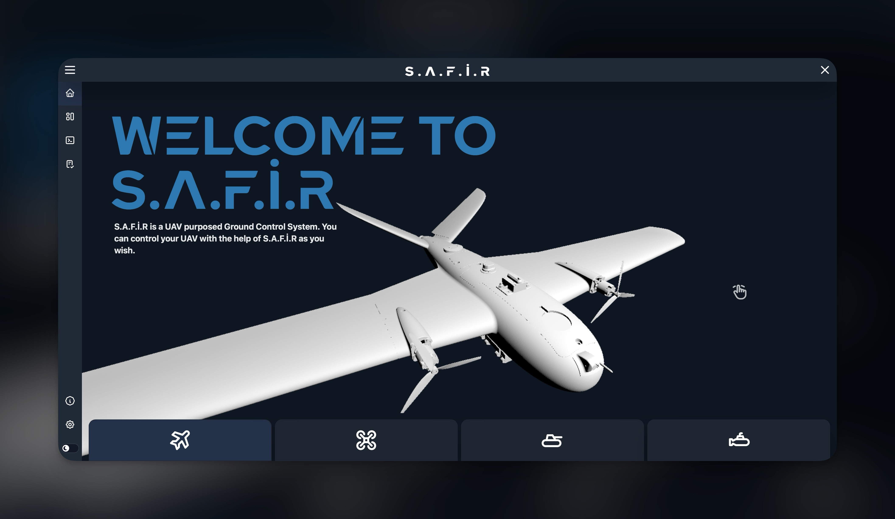
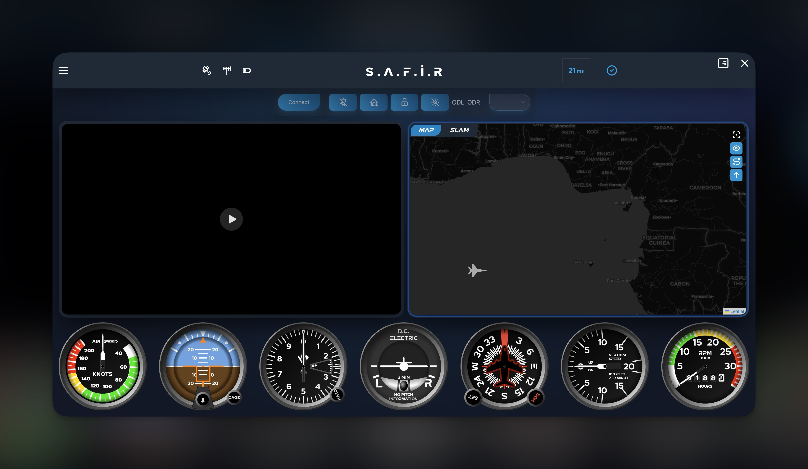
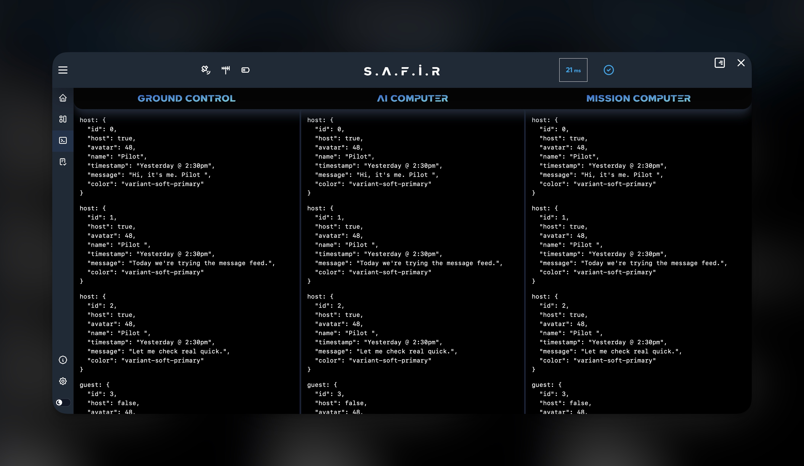
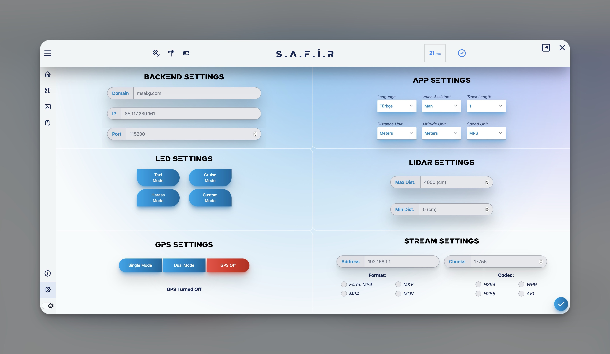

# GCS

Ground Control Station for Unmanned Devices that uses [Mavlink](https://mavlink.io/en/).

## Showcase

### Homepage



### Dashboard



### Telemetry



### Settings



## Usage

```
bun i
bun run tauri dev
```
